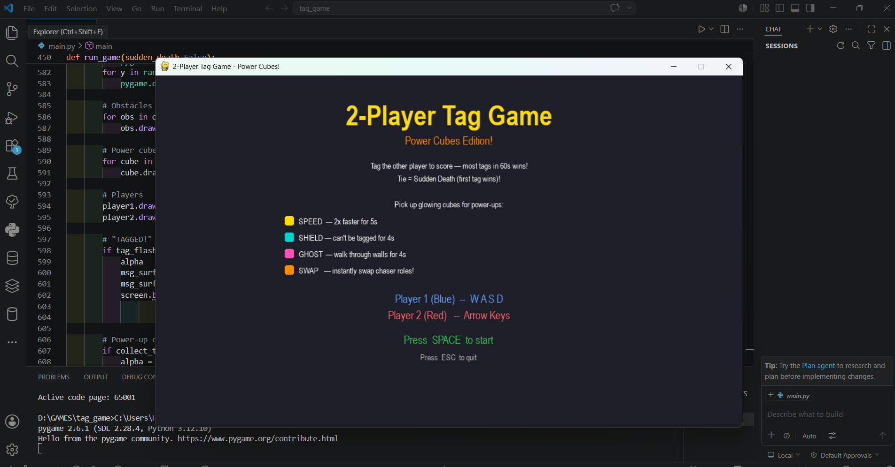
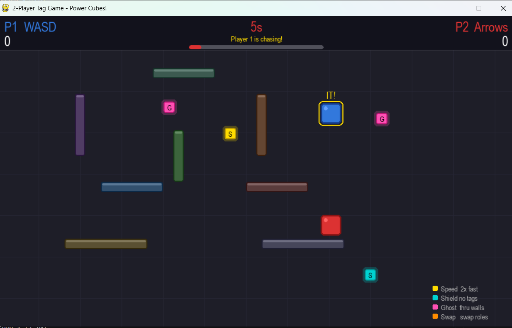

# 🎮 2-Player Tag Game – Power Cubes Edition

A fast-paced local multiplayer arcade game built with Python and Pygame.  
Chase, dodge, survive, and outsmart your opponent in an action-packed arena filled with glowing power cubes and dynamic abilities.

---

## ✨ Game Features

⚡ Smooth 2-player gameplay  
🧱 Arena obstacles and tactical movement  
💎 Unique Power Cube abilities  
🔥 Sudden Death overtime mode  
🎨 Clean visuals, animations, glow effects, and HUD  
🎮 Competitive local multiplayer fun

---

## 💠 Power Cubes

| Power Cube | Ability |
|------------|----------|
| ⚡ SPEED | Move 2x faster |
| 🛡️ SHIELD | Become immune to tags |
| 👻 GHOST | Walk through obstacles |
| 🔄 SWAP | Instantly switch chaser roles |

---

## 🎮 Controls

### Player 1 (Blue)
`W A S D`

### Player 2 (Red)
`Arrow Keys`

---

## 🏆 Objective

Tag your opponent before time runs out.  
The player with the most tags wins.

If the score is tied, the game enters:

# 🔥 SUDDEN DEATH 🔥

First successful tag wins the match.

---

## 🛠️ Built With

- Python
- Pygame

---

## 🚀 Run The Game

## 📸 Gameplay Preview

pip install pygame
python main.py
